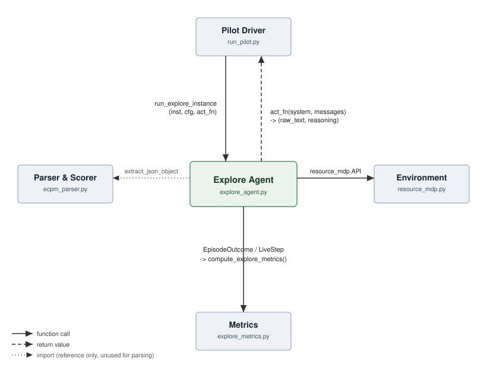
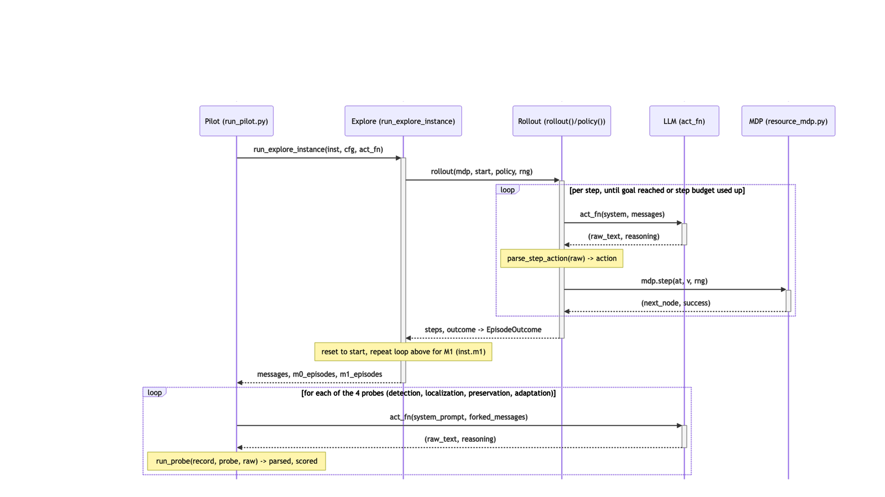

# Explore Agent - Documentation

**Christian Henne**

## Purpose

We study whether an LLM can infer an environment's structure and
adapt after a hidden change. Two pilot types run on the same environment and scoring (`resource_mdp.py` + `ecpm_parser.py`), selected
via `run_pilot.py --pilot-type passive|active`:

- **Passive** (`run_pilot.py`'s original pilot): a non-LLM simulator
  collects a batch of episodes with a mechanical policy and hands the
  model a static transcript to read.
- **Active** (`explore_agent.py`, this document): the model picks its own
  actions step by step and observes the real outcome, first on the
  pre-change world (**M0**), then, after a reset, on
  the post-change world (**M1**).

## Quickstart

No API key needed:

```bash
# dry-run smoke test
python3 explore_agent.py
```

```bash
# dry-run, deterministic world only
python3 run_pilot.py --pilot-type active --mode det
```

```bash
# dry-run, stochastic world only
python3 run_pilot.py --pilot-type active --mode sto
```

With an LLM explorer:

```bash
# configure api key, run with Claude Sonnet 4, deterministic and stochastic world
ANTHROPIC_API_KEY=... python3 run_pilot.py \
    --pilot-type active --provider anthropic --model claude-sonnet-4-6 \
    --max-tokens 4096
```

```bash
# small M0 sanity check on Azure (AZURE_OPENAI_API_KEY must already be exported)
python3 run_pilot.py --pilot-type active \
    --provider azure --model gpt-5-mini \
    --azure-endpoint https://christian-ecpm.openai.azure.com \
    --mode det --m0-episodes 2 --m1-episodes 1 --max-steps-per-episode 15 \
    --max-tokens 4096
```

Outputs land in `pilot_artifacts/`, built from the data types below.

## Parameters

`run_pilot.py --pilot-type active` exposes six of `ExploreConfig`'s eight
fields directly as flags, plus two further active-pilot-only flags that
sit outside `ExploreConfig` entirely (`--condition`, `--thinking-budget`).
Two `ExploreConfig` fields are fixed at their dataclass default with no
flag to change them.

| Parameter | CLI flag | `ExploreConfig` field | Default |
| --- | --- | --- | --- |
| Number of M0 episodes | `--m0-episodes` | `max_episodes_m0` | 4 |
| Number of M1 episodes | `--m1-episodes` | `max_episodes_m1` | 4 |
| Steps per episode | `--max-steps-per-episode` | `max_steps_per_episode` | 25 |
| Response attempts | *(none)* | `max_retries_per_step` | 2, not settable via CLI |
| Change disclosure | `--announce-change` | `announce_change` | off (unannounced) |
| Context management | `--explore-context-budget` | `max_context_tokens_est` | 12000 |
| Minimum retained turns | *(none)* | `keep_last_n_turns_min` | 6, not settable via CLI |
| Random seed | *(none)* | `seed` | fixed to `GRAPH_SEED` (7), not user-settable |
| Scenario / condition | `--condition` | *(not part of `ExploreConfig`)* | `silent_break`, choice of five scenarios |
| Extended thinking budget | `--thinking-budget` | *(not part of `ExploreConfig`)* | 0 (off); Anthropic provider only |

**Response attempts** is the correction-attempt budget behind
`LiveStep.parse_status == "retries_exhausted"` in the table below. Running
out of retries ends the episode immediately (`EpisodeOutcome.outcome ==
"retries_exhausted"`) with one final diagnostic step logged, rather than
substituting a random legal action and continuing.

## Key data types

**`LiveStep`** — one model-chosen step, logged in full.

| Field | Meaning                                                                                                                                                                                         |
| --- |-------------------------------------------------------------------------------------------------------------------------------------------------------------------------------------------------|
| `t` | Step number within the episode                                                                                                                                                                  |
| `node` | Node the model was at when it chose the action                                                                                                                                                  |
| `chosen` | Node it tried to move to                                                                                                                                                                        |
| `success` | Whether the move actually worked                                                                                                                                                                |
| `next_node` | Node it is at after this step                                                                                                                                                                   |
| `phase` | `"m0"` (pre-change) or `"m1"` (post-change)                                                                                                                                                     |
| `episode_idx` | Which episode (0-based) this step belongs to                                                                                                                                                    |
| `action_label` | The `aK` label the model actually chose                                                                                                                                                         |
| `parse_status` | How parsing went: `ok \| malformed_json \| invalid_object \| illegal_action \| retries_exhausted`                                                                                               |
| `retries` | Correction attempts before this action was accepted                                                                                                                                             |
| `raw_text` | The model's full reply for this step, i.e. what actually gets replayed as conversation history                                                                                                  |
| `reasoning` | The model's reasoning for this step, kept separate so it is logged without being replayed back into the conversation (empty for dry-run and for providers without a distinct reasoning channel) |

`t, node, chosen, success, next_node` are identical in shape to
`resource_mdp.Attempt`, so a list of `LiveStep` can be passed unmodified
into `resource_mdp`'s existing scoring functions (`broken_link_usage`,
`emit_f1_log`, `attempt_stats`, ...).

**`EpisodeOutcome`** — one complete attempt to get from start to goal.

| Field | Meaning |
| --- | --- |
| `episode_idx` | Which episode (0-based) |
| `phase` | `"m0"` or `"m1"` |
| `steps` | Every step taken in this episode |
| `outcome` | `reached_goal`, `horizon_cutoff`, or `retries_exhausted` |

**`ExploreConfig`** — the tunable settings for one run.

| Field | Meaning |
| --- | --- |
| `max_episodes_m0` | Max episodes run on the pre-change world |
| `max_episodes_m1` | Episodes run on the post-change world (always runs all of them) |
| `max_steps_per_episode` | Step limit per episode |
| `max_retries_per_step` | Correction retries for a bad action before giving up |
| `announce_change` | Ablation flag: explicitly tell the model the world may have changed at the M0→M1 reset |
| `max_context_tokens_est` | Trim old turns once the transcript's estimated token count exceeds this |
| `keep_last_n_turns_min` | Never trim below this many recent turns |
| `seed` | Base seed for reproducible runs |

## Key methods

| Function | Role                                                                                                                                     |
| --- |------------------------------------------------------------------------------------------------------------------------------------------|
| `extract_last_json_object`, `parse_step_action` | Parse the model's chosen action from free text. Takes the LAST balanced JSON object in the reply, so the model may reason in prose first |
| `build_system_prompt`, `render_step_observation`, `trim_history` | Build the prompt/message stream and keep it within the context budget                                                                    |
| `dry_run_policy` | Network-free, epsilon-greedy stand-in for a live LLM, used for testing without an API key                                                |
| `_build_recording_policy` | Core: wraps an (`act_fn`) or dry-run action source into a logging `policy(u, rng) -> node`, appending to `messages` and `step_meta`      |
| `make_llm_policy` | Thin public wrapper for the LLM path                                                                                                     |
| `_zip_steps` | Merges `rollout()`'s attempt log with the policy's own metadata into `LiveStep` records                                                  |
| `run_explore_instance` | Orchestrates the full M0-then-M1 run for one instance, returning the transcript and both episode lists                                   |

## Metrics

`explore_metrics.compute_explore_metrics(inst, m0_episodes, m1_episodes)` turns the raw
`LiveStep` logs into 14 named metrics, reusing `resource_mdp`'s frozen scoring primitives
(`broken_link_usage`, `score_route`) unmodified. Exact formulas are in
`explore_metrics.pdf`.

| Metric | Meaning                                                                                                          |
| --- |------------------------------------------------------------------------------------------------------------------|
| `optimal_action_rate_m0` / `_m1` | How often the model's chosen action matched an optimal one, averaged per episode                                 |
| `broken_link_usage_before_first_failure` | How often the broken edge was chosen before the model ever saw it fail                                           |
| `broken_link_usage_after_first_failure` | How often it was chosen again after that first failure. High means it kept trying despite knowing better         |
| `adaptation_lag_steps` | How many steps passed between the first and the last attempt at the broken edge — how long it took to stop       |
| `steps_to_goal_m0` / `_m1` | Average and median episode length, counting only episodes that actually reached the goal                         |
| `episode_outcome_counts_m0` / `_m1` | How many episodes ended in `reached_goal` vs. `horizon_cutoff` vs. `retries_exhausted`                          |
| `route_regret_m0` / `_m1` | How much more expensive the realized route was than the true optimal route, averaged over goal-reaching episodes |
| `parse_failure_rate_m0` / `_m1` | Share of steps where the reply didn't parse as a valid action                                                    |
| `retries_exhausted_rate_m0` / `_m1` | Share of steps where retries ran out and the episode was ended early                                             |

Note the aggregation difference: `optimal_action_rate` is a **mean of per-episode rates**
(each episode weighted equally), while `parse_failure_rate`/`retries_exhausted_rate` are **pooled
over every step in the phase** (each step weighted equally) — an episode with more steps
contributes more to the latter two, but not to the former.

| `per_episode_m0` / `_m1` | List of `{episode_idx, outcome, optimal_action_rate, route_regret}`, one entry per episode, in run order |

## Interfaces

`explore_agent.py` sits between the pilot driver and the frozen
environment. It calls into `resource_mdp.py` for the environment
primitives (`rollout`, `legal_actions`, `invert_labels`, `explore_policy`
for dry-run), and it imports `ecpm_parser.extract_json_object` only for
reference/comparison. Step-level parsing uses its own
`extract_last_json_object` instead, because the model may reason before
answering and the LAST JSON object in the reply is the one that counts
(`ecpm_parser`'s frozen probes take the FIRST one, since those replies are
not supposed to contain any reasoning at all). `run_pilot.py` drives the
loop by providing `act_fn`, and passes the returned episodes on to
`explore_metrics.py` for scoring.



## Sequence diagram

One instance run: `run_pilot.py` builds the paired instance and calls
`run_explore_instance`, which runs `rollout()` against M0 for the
configured number of episodes, then resets and repeats against M1. Each
step inside `rollout()` calls the recording policy, which renders the
current observation, calls `act_fn`, parses the reply, and steps the real
MDP. Retrying on an illegal action up to `max_retries_per_step` times.


