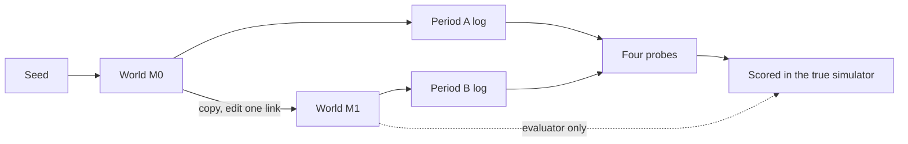
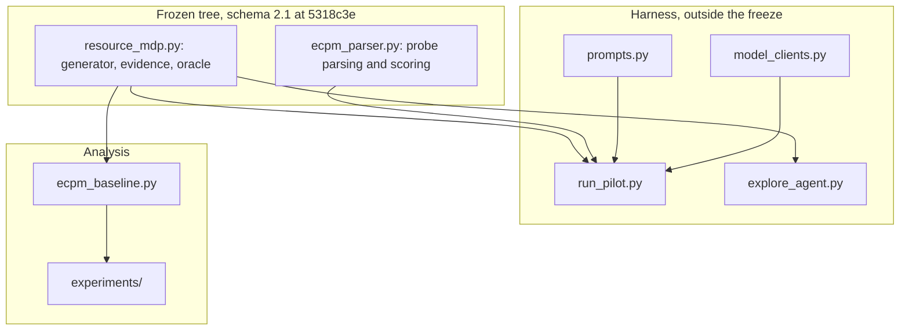
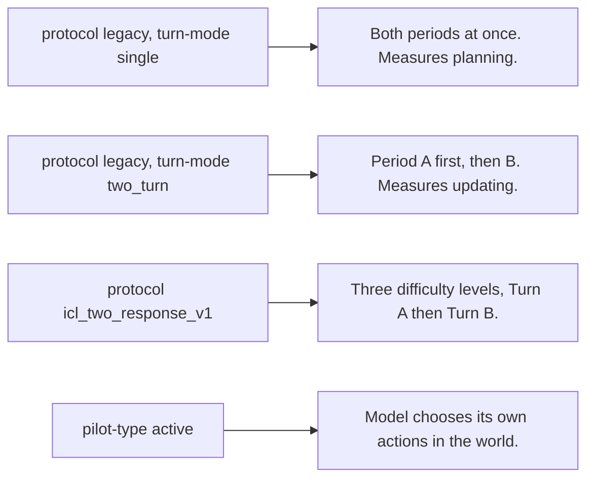

# ECPM

Can a frozen LLM infer an environment's transition structure from observation
logs alone, and replan after a hidden change?

The environment is an 8-node packet-routing MDP, generated as a pair: a world
M0, and a copy M1 carrying zero or one recorded intervention. The model sees
balanced evidence from both periods and answers four probes: detection,
localization, preservation, adaptation. Routes are scored by execution in the
true simulator (expected cost and regret), never by the model's own judgment.

## What the experiment does



The model never sees the graph. It sees attempt and outcome logs plus the
action menu at each node. Action labels are shuffled per node, so a label
carries no information about where it leads.

## The six interventions

Five edit a link; one edits nothing. Only `redirect` changes a destination.

| Condition | Edit | What it tests |
| --- | --- | --- |
| `no_change` | none | false positives |
| `irrelevant` | off-route link U\* to p = 0 | change noticed, judged harmless |
| `silent_break` | on-route target T\* to p = 0, stays on the menu | inferring failure from absent successes |
| `hard_removal` | T\* leaves the menu | control: visible by menu diff alone |
| `degradation` | T\* probability halved (stochastic only) | re-planning after partial change |
| `redirect` | T\* keeps its probability, destination moves | structure learned, or only rates? |

`silent_break`, `hard_removal`, `degradation` and `redirect` share one target
stream, so they edit the same T\* for a given seed. The gap between
`silent_break` and `hard_removal` measures how much performance comes from
reading evidence rather than comparing menus.

## Why redirect exists

An evidence-only baseline (`ecpm_baseline.py`) answers the same four probes by
arithmetic over the same prompt view, with no reasoning. Measured over seeds
1 to 30 (`runs/baseline_k_sweep_seeds1-30.json`), it localizes the changed
pair at these rates:

| mode | condition | n | K=5 | K=10 | K=20 |
| --- | --- | --- | --- | --- | --- |
| stochastic | `silent_break` | 23 | 0.74 | 0.96 | 1.00 |
| stochastic | `degradation` | 23 | 0.30 | 0.65 | 0.91 |
| stochastic | `irrelevant` | 30 | 0.83 | 1.00 | 1.00 |
| stochastic | `hard_removal` | 23 | 1.00 | 1.00 | 1.00 |
| stochastic | `redirect` | 23 | 0.09 | 0.00 | 0.04 |
| deterministic | all except redirect | 23 to 30 | 1.00 | 1.00 | 1.00 |

A counter solves deterministic mode outright and stochastic `silent_break` by
K = 10. `redirect` is the exception, and it does not improve as K grows,
because a redirect preserves every success rate and moves only a destination.
It is the one condition where beating the baseline demonstrates something
counting cannot do.

This makes the baseline the reference every model result is read against
rather than a control. It also enforces the project rule that no model may be
said to fail at localization on an instance the baseline cannot solve either.

## Repository layout



- `resource_mdp.py` environment: paired generator, evidence collection,
  `prompt_view()`, oracle
- `ecpm_parser.py` frozen parser and probe scoring (docs/INTERFACE.md section 7)
- `prompts.py` prompt templates and block builders
- `model_clients.py` provider calls, including reasoning-model compatibility
- `run_pilot.py` pilot harness; pins the freeze SHA into every artifact
- `explore_agent.py`, `explore_metrics.py` agentic exploration arm
- `ecpm_baseline.py` evidence-only baseline (the null model)
- `experiments/baseline_k_sweep.py` baseline accuracy by condition and K
- `experiments/seed_eligibility.py` the three eligibility criteria, recomputed
- `experiments/summarize_run.py` run artifacts to the reported statistics
- `experiments/azure_budget.py` run costing from measured token usage
- `experiments/run_two_turn_azure.sh` the two-turn run, resumable
- `docs/` interface contract, paper spine, seed criteria, diagrams
- `archive/` freeze sign-off tooling, kept for provenance, not maintained
- `runs/` artifacts, one directory per run
- `exploratory/` prompt-safe packets, oracle packets, probability scorer

Tests are stdlib only: `test_resource_mdp.py`, `test_ecpm_parser.py`,
`test_explore_agent.py`, `test_ecpm_baseline.py`, `test_run_pilot.py`,
`test_prompt_contract.py`.

## Freeze

Schema 2.1 is frozen at commit `5318c3e`. Artifacts are valid only if produced
against that environment tree; each records `frozen_sha`, `git_head` and
`pinned_to_freeze`.

`redirect` (2026-09-12) is an additive extension above the frozen schema. It
emits its second endpoint as `change.new_edge` only for redirect instances, so
records for the other five conditions are byte-identical to before and the
shipped examples still regenerate exactly. `SCHEMA_VERSION` therefore remains
`2.1`; v2.2 and v2.3 are document revisions, not schema bumps.

## Quickstart

    git clone https://github.com/itu-itis25-bektes23/ecpm
    cd ecpm
    python3 test_resource_mdp.py
    python3 test_ecpm_parser.py
    python3 test_ecpm_baseline.py
    python3 run_pilot.py            # dry run, no API key needed

## Running the pilots



Single turn, the frozen prompts:

    python3 run_pilot.py --scenario seed7_silent_break

Two turn. Period A only in turn 1 (`route_pre`, `belief_pre`), period B
revealed in turn 2, optionally re-eliciting beliefs for a self-consistency
check:

    python3 run_pilot.py --turn-mode two_turn --reelicit --tag twoturn_v1

The distinction is load-bearing. A model shown both periods at once can route
around a break it never noticed, so single-turn results measure planning from
evidence rather than updating.

Three-level ICL protocol, with repeats and provider sampling seeds:

    python3 run_pilot.py --protocol icl_two_response_v1 \
      --scenario icl_det_gate_seed8 --mode det \
      --repeats 3 --sampling-seeds 0 1 2 --reasoning-mode off \
      --provider dry-run --tag icl_gate

Audited local Gemma 4 E4B Instruct Q6_K (GGUF) gate:

Runtime: Bionic 1.1.2+11; `gemma-4-E4B-it-Q6_K.gguf`; context 16,384;
evaluation/physical batch 512/256; parallel 1; Flash Attention and KV-cache
offload enabled; repeat penalty 1.0; Min P and speculative decoding disabled.

```bash
python3 -B run_pilot.py \
  --protocol icl_two_response_v1 \
  --scenario icl_det_gate_seed8 \
  --mode det \
  --provider openai \
  --model sunil-pathak/gemma-4-e4b-it \
  --base-url http://localhost:1234/v1 \
  --temperature 1.0 \
  --top-p 0.95 \
  --top-k 64 \
  --repeats 3 \
  --sampling-seeds 0 1 2 \
  --sampling-seed-support supported \
  --reasoning-mode off \
  --reasoning-control-json '{"reasoning":"off"}' \
  --reasoning-control-source 'Bionic 1.1.2+11; Q6_K local API audit: reasoning=off accepted, reasoning_tokens=0' \
  --max-tokens 4096 \
  --timeout 900 \
  --tag icl_gate_gemma4e4b_q6k_det_off
```

Supply optional `--top-p` and `--top-k` values only after verifying that the
endpoint supports them.

Agentic exploration, where the model picks its own actions instead of reading
a collected log (see `docs/EXPLORE_AGENT.md`):

    python3 run_pilot.py --pilot-type active --scenario seed7_silent_break

With a provider:

    AZURE_OPENAI_API_KEY=... python3 run_pilot.py \
        --provider azure --model YOUR-DEPLOYMENT \
        --azure-endpoint https://YOUR-RESOURCE.openai.azure.com

    ANTHROPIC_API_KEY=... python3 run_pilot.py \
        --provider anthropic --model claude-sonnet-4-6

`--max-tokens` defaults to 4096. The earlier 1024 default truncated verbose
models mid-answer. Outputs land in `pilot_artifacts/`.

## Named scenarios

    python3 run_pilot.py --list-scenarios

`seed7_silent_break`, `seed7_hard_removal`, `seed7_degradation` (stochastic
only), `seed7_irrelevant`, `seed7_no_change` (localization dropped, since it
has a false premise), `seed7_silent_break_narrative` and
`seed7_silent_break_stats` (rendering ablations), and `icl_det_gate_seed8`.

`redirect` has no named scenario yet and is reached with
`--condition redirect`. The log header then reports the scenario it overrode,
which is cosmetic but misleading.

## Seeds, baseline and budget

    python3 experiments/seed_eligibility.py
    python3 experiments/baseline_k_sweep.py --seeds 1-30
    python3 experiments/azure_budget.py --budget 100

The run set is 23 matched seeds in stochastic mode, generated by
`seed_eligibility.py` rather than listed by hand, and read from
`runs/seed_eligibility.json` by the run script so the two cannot drift. Nine
degradation cells where the optimal route does not move are labelled
`restraint` rather than excluded; see `docs/SEED_SELECTION.md`.

The budget model is anchored on measured usage, not estimates: the archived
Azure run used 5413 prompt and 220 completion tokens for one four-probe
single-turn conversation at K = 5.

## Azure access

1. Startup credits: https://www.microsoft.com/en-us/startups
2. In portal.azure.com create an Azure OpenAI resource. The resource name sets
   the endpoint: `https://NAME.openai.azure.com`.
3. Deploy a chat model. The deployment name is the `--model` argument. On a
   404, check the deployment name and try `--api-version 2024-10-21`.

Reasoning models (GPT-5 and GPT-6 families) reject `temperature` and
`max_tokens` on Chat Completions; `model_clients.py` detects them and uses
`max_completion_tokens` instead. Several Claude models reject `temperature`
and are listed there too.

## Pilot status

`runs/2026-09-12_gpt4o_twoturn_k10/` is the first two-turn run at scale:
GPT-4o, 23 matched seeds, K=10, three stochastic conditions, 69 instances,
every probe parsed. Summarise it with
`python3 experiments/summarize_run.py runs/2026-09-12_gpt4o_twoturn_k10`.

Earlier seed-7 pilots ran on the frozen tree with claude-sonnet-4-6, gpt-4o
on Azure, and Gemma 4 E4B locally. Artifacts are archived per run under
`runs/`.

Two directories are kept deliberately and are not duplicates.
`runs/2026-08-23_sonnet46_mt1024/` is the truncation failure that motivated
raising the `--max-tokens` default, and is the evidence for that change.
`*_dryrun.json` files are oracle-derived pipeline demos rather than model
runs; they exercise the parser and scorer without an API call.

## What is not done

Stated explicitly rather than left implicit.

- No model has been run against `redirect`, `hard_removal` or `degradation`,
  nor against the three-level ICL protocol, nor in deterministic mode under
  the two-turn protocol. Those artifacts do not exist yet.
- There is no cross-artifact aggregation. Contrasts between turn-1 and turn-2
  routes, between stated beliefs and chosen routes, and confidence intervals
  over conditions are all specified in `docs/PAPER_SPINE.md` and unbuilt. They
  are pure functions of stored artifacts, so runs done now remain usable.
- Route numbers predating the start/goal scoring fix are void. The affected
  results sections need regenerating.
- Deterministic mode has only 3 of 30 seeds meeting all three eligibility
  criteria, because integer hop costs make unique optima rare. Whether to
  relax the uniqueness criterion is an open decision; see
  `docs/SEED_SELECTION.md`.
- Every cell of the current model evidence is n = 1. The findings are
  demonstrations of a phenomenon, not estimates of a rate.
- `docs/INTERFACE.md` is titled v2.2 but declares schema version 2.1 internally.
  The declaration is correct; the title is a document revision number.

## Write-up

Proposed claim, hypotheses as a pre-registration, readiness audit and budget:
`docs/PAPER_SPINE.md`. Full explanation and figures: "ECPM Phase 2: The Gist"
in the team research doc.
