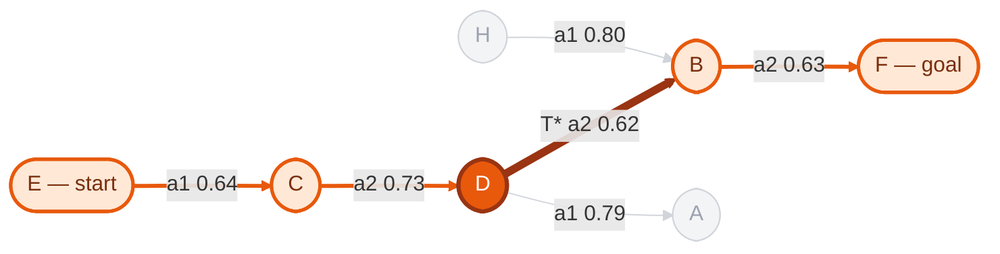
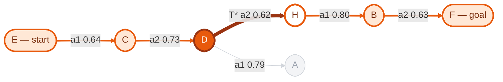
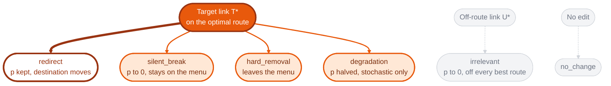
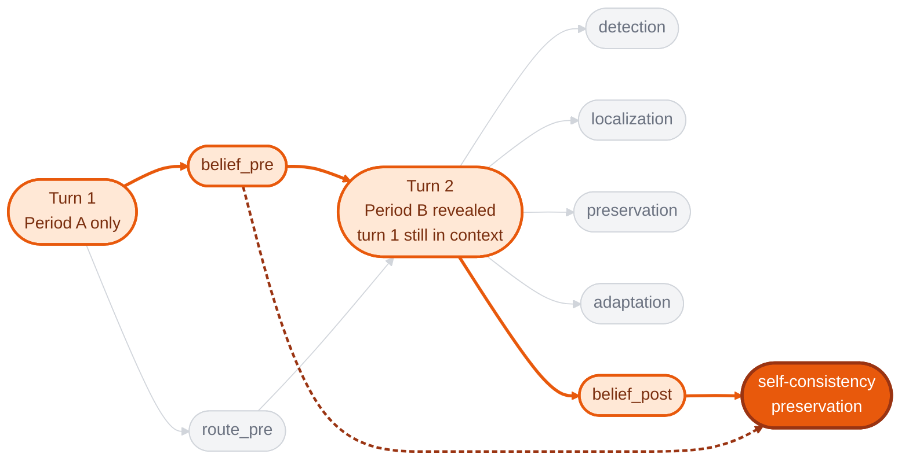
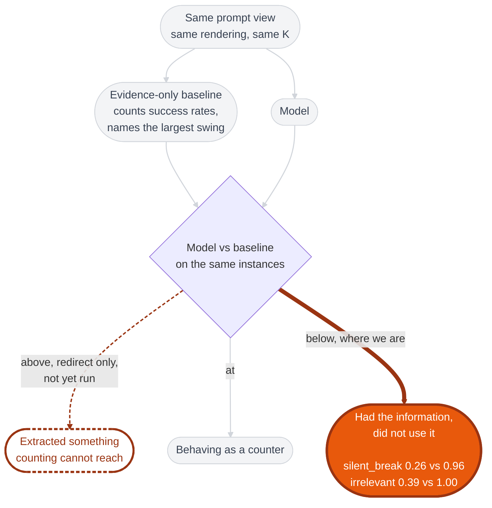
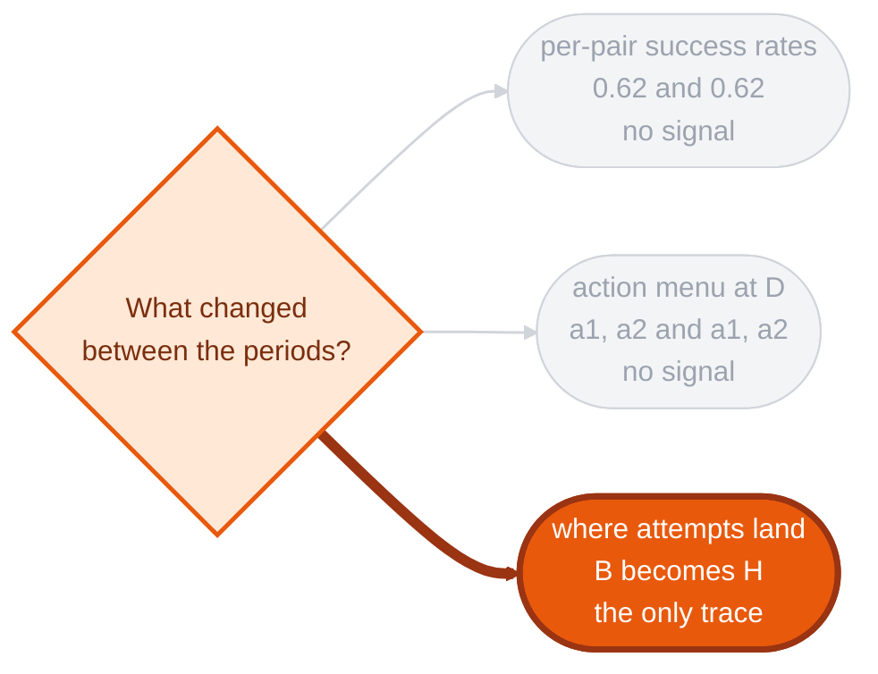

# Mermaid diagrams for the methodology document

Orange marks the intervention, what follows from it, and the cells holding
the result. Everything else is grey.

All numbers come from seed 7 and from `runs/`, checked against the code at
`594038c`, not transcribed from the document.

---

## 1. Redirect on seed 7, before and after

The optimal route is orange, T\* is the darkest edge on it, off-route links
are grey.

**Before, M0.** Best route E, C, D, B, F at cost 6.13. The thick dark edge is
T\*: node D, action a2, probability 0.62, landing on B.

**After, M1.** Same action, same 0.62, now landing on H. The route lengthens
to E, C, D, H, B, F at cost 7.38. H, outlined in orange, is the new stop.

The menu at D is unchanged: still `a1, a2`. Every per-pair success rate is
unchanged. Only the destination column of the log differs.

---

## 2. The six interventions

All four route-changing conditions share one target stream, so for a given
seed they edit the same T\*. `redirect` is drawn heaviest: it is the only one
a counting method cannot solve. The two controls are grey.

---

## 3. Two-turn probe delivery

The orange path is the belief chain: elicit beliefs on Period A, reveal
Period B, re-elicit, then score the second set against the model's own first
set rather than against ground truth. It is the only probe measuring
self-consistency rather than correctness. The grey probes are scored against
ground truth.

---

## 4. The null model and the three regions

Measured on 23 matched seeds at K = 10, stochastic. The dashed outline is the
region `redirect` was built to open; it stays dashed until a model has been
run there.

---

## 5. Why redirect defeats the counter

Two of the three columns a counting method reads are identical across
periods. Only the third carries the change, and a rate comparison never looks
there. In deterministic mode this is absolute: every link is p = 1, so all
fifteen pairs tie at exactly zero and the counter has nothing.

Baseline localization on `redirect`: 0.09 at K = 5, 0.00 at K = 10, 0.04 at
K = 20. Flat, because more evidence cannot create a signal that is not in the
rates.

---

## Figure 2, updated

Orange marks the off-diagonal.

| | Route optimal | Route suboptimal |
| --- | --- | --- |
| **Localization correct** | 3 | 3 |
| **Localization incorrect** | **6** | 11 |

GPT-4o, two-turn, `silent_break`, stochastic, 23 matched seeds, K = 10.
Off-diagonal 9 of 23.

In the lower-left cell the model routed optimally without localizing. Under
two-turn it had already committed to a Period A route before Period B was
revealed, so planning from Period B does not explain those six.

When rendering, fill that cell solid `#E8590C` with white text and give the
upper-right cell the `#FFE8D6` tint with an orange border.

Keep the Gemma figure beside it. Model, K and delivery all changed, so it is
a second row rather than a replacement.

---

## Palette

| use | colour | where |
| --- | --- | --- |
| the finding, the intervention | `#E8590C` solid fill, white text | T\*, `redirect`, below-baseline, the 2x2 cell |
| the heaviest stroke | `#9A3412` | T\* edge, the one arrow that matters |
| on the causal chain | `#FFE8D6` fill, `#E8590C` border | optimal route, belief chain |
| open question, not yet run | white fill, `#9A3412` dashed border | the "above baseline" region |
| off the chain | `#F3F4F6` fill, `#D1D5DB` border | controls, off-route links, ground-truth probes |
| chain text | `#7A2E0E` | labels inside tinted nodes |

Orange is reserved for the intervention and its consequences. Grey is for
everything else.

**One deliberate exception to the no-em-dash rule.** The labels `E — start`
and `F — goal` keep the dash because the existing Figure 1 uses that form.
Matching a published figure beats a prose rule about sentences.
