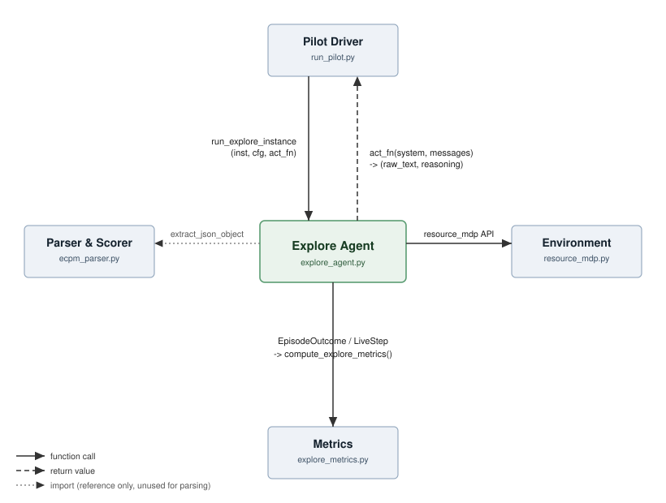
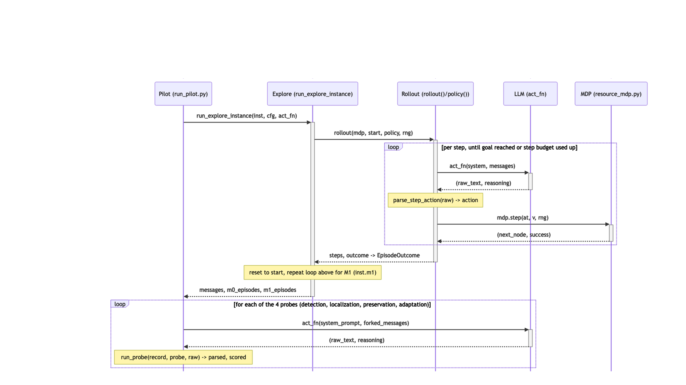

# Explore Agent - Documentation

**Christian Henne**

## Purpose

We study whether an LLM can infer an environment's structure and
adapt after a hidden change. Two pilot types run on the same environment and scoring (`resource_mdp.py` + `ecpm_parser.py`), selected
via `run_pilot.py --pilot-type passive|active`:

- **Passive** (`run_pilot.py`'s original pilot): a non-LLM simulator
  collects a batch of episodes with a mechanical policy and hands the
  model a static transcript to read.
- **Active** (`explore_agent.py`, this document): the model picks its own
  actions step by step and observes the real outcome, first on the
  pre-change world (**M0**), then, after a reset, on
  the post-change world (**M1**).

## Quickstart

No API key needed:

```bash
# dry-run smoke test
python3 explore_agent.py
```

```bash
# dry-run, deterministic world only
python3 run_pilot.py --pilot-type active --mode det
```

```bash
# dry-run, stochastic world only
python3 run_pilot.py --pilot-type active --mode sto
```

With an LLM explorer:

```bash
# configure api key, run with Claude Sonnet 4, deterministic and stochastic world
ANTHROPIC_API_KEY=... python3 run_pilot.py \
    --pilot-type active --provider anthropic --model claude-sonnet-4-6 \
    --max-tokens 4096
```

```bash
# small M0 sanity check on Azure (AZURE_OPENAI_API_KEY must already be exported)
python3 run_pilot.py --pilot-type active \
    --provider azure --model gpt-5-mini \
    --azure-endpoint https://christian-ecpm.openai.azure.com \
    --mode det --m0-episodes 2 --m1-episodes 1 --max-steps-per-episode 15 \
    --max-tokens 4096
```

```bash
# local Gemma 4 E4B via LM Studio, seed7_no_change scenario
cd /Users/christianhenne/SayN/ecpm
OPENAI_API_KEY=lm-studio python3 run_pilot.py \
    --pilot-type active \
    --scenario seed7_no_change \
    --provider openai --model google/gemma-4-e4b \
    --base-url http://localhost:1234/v1 --timeout 900 \
    --mode det \
    --m0-episodes 4 --m1-episodes 4 \
    --max-steps-per-episode 25 \
    --announce-change \
    --tag gemma4e4b_seed7_no_change
```

```bash
cd /Users/christianhenne/SayN/ecpm
python3 run_pilot.py \
    --pilot-type active \
    --scenario seed7_silent_break \
    --provider azure --model gpt-4o \
    --azure-endpoint https://christian-ecpm.openai.azure.com \
    --mode det \
    --m0-episodes 4 --m1-episodes 4 \
    --max-steps-per-episode 25 \
    --announce-change \
    --tag gpt4o_seed7_silent_break_run2
```

Outputs land in `pilot_artifacts/`, built from the data types below.

## Parameters

`run_pilot.py --pilot-type active` exposes six of `ExploreConfig`'s eight
fields directly as flags, plus two further active-pilot-only flags that
sit outside `ExploreConfig` entirely (`--condition`, `--thinking-budget`).
Two `ExploreConfig` fields are fixed at their dataclass default with no
flag to change them.

| Parameter | CLI flag | `ExploreConfig` field | Default |
| --- | --- | --- | --- |
| Number of M0 episodes | `--m0-episodes` | `max_episodes_m0` | 4 |
| Number of M1 episodes | `--m1-episodes` | `max_episodes_m1` | 4 |
| Steps per episode | `--max-steps-per-episode` | `max_steps_per_episode` | 25 |
| Response attempts | *(none)* | `max_retries_per_step` | 2, not settable via CLI |
| Change disclosure | `--announce-change` | `announce_change` | off (unannounced) |
| Context management | `--explore-context-budget` | `max_context_tokens_est` | 12000 |
| Minimum retained turns | *(none)* | `keep_last_n_turns_min` | 6, not settable via CLI |
| Random seed | *(none)* | `seed` | fixed to `GRAPH_SEED` (7), not user-settable |
| Scenario / condition | `--condition` | *(not part of `ExploreConfig`)* | `silent_break`, choice of five scenarios |
| Extended thinking budget | `--thinking-budget` | *(not part of `ExploreConfig`)* | 0 (off); Anthropic provider only |

**Response attempts** is the format-correction budget behind
`LiveStep.parse_status == "retries_exhausted"` in the table below. Running
out of retries ends the episode immediately (`EpisodeOutcome.outcome ==
"retries_exhausted"`) with one final diagnostic step logged, rather than
substituting a random legal action and continuing.

A readable action choice outside the current menu is not a format error.
It consumes one simulator step, leaves the agent at the same node, and
receives an explicit unavailable-action response. There is no free retry;
the next choice is a new decision with a reduced step budget. This applies
both to removed actions and unknown labels. Legal actions retain their
usual success probabilities, including silent breaks.

Active artifacts record `explore.action_protocol` as
`illegal_action_costs_step_v1`. Runs made under the earlier free-correction
rule used a different action protocol and should not be pooled silently.

## Key data types

**`LiveStep`** — one model-chosen step, logged in full.

| Field | Meaning                                                                                                                                                                                         |
| --- |-------------------------------------------------------------------------------------------------------------------------------------------------------------------------------------------------|
| `t` | Step number within the episode                                                                                                                                                                  |
| `node` | Node the model was at when it chose the action                                                                                                                                                  |
| `chosen` | Intended destination, including the old target of a removed action; empty for unknown labels and parser-abort diagnostics |
| `success` | Whether the move actually worked                                                                                                                                                                |
| `next_node` | Node it is at after this step                                                                                                                                                                   |
| `phase` | `"m0"` (pre-change) or `"m1"` (post-change)                                                                                                                                                     |
| `episode_idx` | Which episode (0-based) this step belongs to                                                                                                                                                    |
| `action_label` | The `aK` label the model actually chose                                                                                                                                                         |
| `parse_status` | How parsing went: `ok \| malformed_json \| invalid_object \| illegal_action \| retries_exhausted`                                                                                               |
| `retries` | Format-correction attempts before the final reply, which can still name an unavailable action |
| `raw_text` | The model's full reply for this step, i.e. what actually gets replayed as conversation history                                                                                                  |
| `reasoning` | The model's reasoning for this step, kept separate so it is logged without being replayed back into the conversation (empty for dry-run and for providers without a distinct reasoning channel) |

`t, node, chosen, success, next_node` are identical in shape to
`resource_mdp.Attempt`, so a list of `LiveStep` can be passed unmodified
into `resource_mdp`'s existing scoring functions (`broken_link_usage`,
`emit_f1_log`, `attempt_stats`, ...).

**`EpisodeOutcome`** — one complete attempt to get from start to goal.

| Field | Meaning |
| --- | --- |
| `episode_idx` | Which episode (0-based) |
| `phase` | `"m0"` or `"m1"` |
| `steps` | Every step taken in this episode |
| `outcome` | `reached_goal`, `horizon_cutoff`, or `retries_exhausted` |

**`ExploreConfig`** — the tunable settings for one run.

| Field | Meaning |
| --- | --- |
| `max_episodes_m0` | Max episodes run on the pre-change world |
| `max_episodes_m1` | Episodes run on the post-change world (always runs all of them) |
| `max_steps_per_episode` | Step limit per episode |
| `max_retries_per_step` | Format-correction retries before giving up; unavailable actions do not retry |
| `announce_change` | Ablation flag: explicitly tell the model the world may have changed at the M0→M1 reset |
| `max_context_tokens_est` | Trim old turns once the transcript's estimated token count exceeds this |
| `keep_last_n_turns_min` | Never trim below this many recent turns |
| `seed` | Base seed for reproducible runs |

## Key methods

| Function | Role                                                                                                                                     |
| --- |------------------------------------------------------------------------------------------------------------------------------------------|
| `extract_last_json_object`, `parse_step_action` | Parse the model's chosen action from free text. Takes the LAST balanced JSON object in the reply, so the model may reason in prose first |
| `build_system_prompt`, `render_step_observation`, `trim_history` | Build the prompt/message stream and keep it within the context budget                                                                    |
| `dry_run_policy` | Network-free, epsilon-greedy stand-in for a live LLM, used for testing without an API key                                                |
| `_build_recording_policy` | Core: wraps an (`act_fn`) or dry-run action source into a logging `policy(u, rng) -> node`, appending to `messages` and `step_meta`      |
| `make_llm_policy` | Thin public wrapper for the LLM path                                                                                                     |
| `_zip_steps` | Merges `rollout()`'s attempt log with the policy's own metadata into `LiveStep` records                                                  |
| `run_explore_instance` | Orchestrates the full M0-then-M1 run for one instance, returning the transcript and both episode lists                                   |

## Metrics

`explore_metrics.compute_explore_metrics(inst, m0_episodes, m1_episodes)` turns the raw
`LiveStep` logs into named metrics. Route Regret uses the frozen MDP's
`plan_cost` and `optimal` methods so that episode values remain unrounded
until reporting; the compatibility scorer `score_route` stays unchanged.
The observation-based M0 reference is defined below; the earlier
`explore_metrics.pdf` does not document these field names and this reference
definition.

| Metric | Meaning                                                                                                          |
| --- |------------------------------------------------------------------------------------------------------------------|
| `goal_success_rate_m0` / `_m1` | Goal-reaching episodes divided by all episodes in the phase, including horizon cutoffs and parser aborts; `None` for an empty phase |
| `n_episodes_m0` / `_m1` | Total episodes in the phase, the denominator of Goal Success Rate |
| `optimal_action_rate_m0` / `_m1` | How often the model's chosen action matched an optimal one, averaged per episode                                 |
| `optimal_action_rate_n_scored_episodes_m0` / `_m1` | Number of episodes with at least one scored decision, the denominator of the episode-level OAR mean |
| `steps_to_goal_m0` / `_m1` | Mean, median and `n_successful_episodes`, counting only episodes that actually reached the goal |
| `episode_outcome_counts_m0` / `_m1` | How many episodes ended in `reached_goal` vs. `horizon_cutoff` vs. `retries_exhausted`                          |
| `route_regret_m0` / `_m1` | Unrounded additional expected cost of the realized route over the true optimal route, averaged over goal-reaching episodes |
| `route_regret_n_valid_routes_m0` / `_m1` | Number of valid goal-reaching routes included in mean Route Regret |
| `parse_failure_rate_m0` / `_m1` | Share of decision records with at least one format error, including successfully corrected replies and exhausted retries |
| `retries_exhausted_rate_m0` / `_m1` | Share of decision records that exhausted format retries and ended the episode |
| `illegal_action_rate_m0` / `_m1` | Share of executed attempts choosing an unavailable action; parser-abort diagnostics excluded; `None` if no attempts |
| `changed_action_usage` | Phase usage and intervention-specific feedback event, with counts and usage after feedback; version `action_label_phase_usage_v1` |
| `changed_action_switch` | Decisions at the changed action's source node until the first legal alternative after feedback, with explicit observation status |
| `m0_reference_action_agreement_m1` | Agreement of M1 choices with the best known routes in the observation-based M0 reference; episode mean over evaluable decisions only |
| `m0_observation_reference` | Versioned M0 action table with observed destinations, attempt/success counts and Laplace-smoothed probabilities |
| `m0_reference_agreement_coverage_m1` | Scored and skipped M1 decision counts, skip reasons, scored episode count and per-episode rates |
| `per_episode_m0` / `_m1` | List of `{episode_idx, outcome, optimal_action_rate, route_regret}`, one entry per episode, in run order |

Note the aggregation difference: `optimal_action_rate` is a **mean of per-episode rates**
(each episode weighted equally), while `parse_failure_rate`/`retries_exhausted_rate` are **pooled
over every step in the phase** (each step weighted equally) — an episode with more steps
contributes more to the latter two, but not to the former.
For these operator diagnostics, each executed action and each final parser
abort contributes one decision record; individual correction replies do
not add to the denominator. A corrected reply followed by an unavailable
action contributes to both the format-error and unavailable-action rates.
An empty decision set has undefined rates (`None`).

Unavailable actions count as nonoptimal decisions in the same-world OAR
and consume steps in Steps to Goal. Aborts remain non-successful episodes
in Goal Success Rate. Route Regret still uses only successful transitions.

### Changed-action usage and feedback

The main comparison is `changed_action_usage.m0` versus `.m1`. Each contains
`rate`, `n_choices` and `n_decisions`: choices of the changed action divided
by executed decisions at its source node, pooled across episodes. All
comparisons use `(node, action_label)`, including redirects and attempted
removed actions. Parser-abort diagnostics are excluded. Without decisions,
the rate is `null`, with zero counts.

`feedback_event` describes available feedback, not inferred recognition:

- Silent break, degradation and irrelevant change: `first_failure`, the
  first failed M1 attempt of the changed action. This is not proof of a
  change in stochastic runs. Subsequent decisions exclude the trigger.
- Redirect: `destination_mismatch`, the first successful M1 move to a
  destination different from that observed for the action in M0. Without
  an observed M0 destination, the status is
  `missing_m0_destination_observation`; simulator knowledge is not substituted.
- Hard removal: `menu_action_absent`, the first M1 policy call at the source
  node after an M0 visit there. The active loop displays every legal menu;
  the M0 visit establishes prior availability. Without that visit, the
  status is `missing_m0_menu_observation`. The menu precedes the current
  choice, so that choice is included in usage after feedback. A parser
  abort can display the menu but contributes no executed decision.

Observed events record `episode_idx`, `t`, and `n_actions_before_feedback`,
the number of executed M1 actions preceding availability of the feedback.
Outcome feedback follows its triggering action; menu feedback precedes the
choice. Current logs provide outcome feedback before subsequent decisions,
including across episode resets. `after_feedback` contains the same rate
and counts. With an observed event but no later source-node decisions its
rate is `null`; without an event the whole field is `null`. Event statuses
distinguish `observed`, `not_observed`, missing M0 observations and
`not_applicable` for no change. No-change runs have no changed-action usage.

Use `changed_action_switch` for the first observed choice of a legal
alternative after the same feedback boundary. `decision_lag` counts executed
decisions at the source node, including the switching decision: switching
at the first opportunity gives one. Illegal choices consume opportunities
but do not count as legal alternatives; parser aborts count as neither.
An observed first switch does not establish sustained or successful adaptation.

The status is `switch_observed`, `no_opportunity`,
`not_observed_before_end` (opportunities occurred but no legal alternative
was chosen), or `no_reference_event`. The lag is `null` unless a switch was
observed. `n_decisions_after_feedback` and `n_actions_after_feedback` describe
the full remaining observation window, including actions after a switch.
`episode_idx` and `t` locate an observed switch.
`changed_action_available` distinguishes a still-offered action from hard
removal, where choosing another action is required for a legal move; it is
`null` without a reference event. The definition is versioned as
`first_legal_alternative_after_feedback_v1`.

### Observation-based M0 reference

The M0 reference uses the public goal and M0 feedback only. Neither the
true edge set, true probabilities nor evaluator-only `chosen` destinations
are inputs. A destination becomes known only after a successful transition;
failed-only actions keep `destination: null`. For each attempted legal
action, `p_hat = (n_successes + 1) / (n_attempts + 2)`. Unattempted menu
actions are not assigned guessed destinations. The reference therefore
contains a subset of the observed environment, not a complete inferred world.

The same estimator is used in deterministic and stochastic runs. With `S`
successes and `F` failures, it is the posterior mean of
`Beta(S + 1, F + 1)` under a `Beta(1, 1)` prior. The current system prompt
does not disclose the simulator's mode, so the reference does not use that
mode to force probabilities to zero or one. This represents uncertainty
from limited observations even when the underlying world is deterministic.
The score currently uses the posterior mean only; it does not propagate
parameter uncertainty into route comparisons.

Planning minimizes expected steps to the goal using edge costs `1 / p_hat`,
without a horizon cutoff, over known transitions with a known route to the
goal. This is not a finite-horizon goal-success objective. An M1
decision is unscorable if its action was never attempted in M0, its M0
destination remains unknown, or no known route connects its destination
to the goal. Such cases are counted by reason, not scored as incorrect.
Parser aborts are excluded. Scorable decisions are compared by node and
action label, not by the actual M1 destination, so redirects retain action
identity. An action removed in M1 can still agree with the old M0 reference.

The score averages the per-episode rates over episodes with at least one
scorable decision. No scorable decisions yields `None`. Always inspect
`m0_reference_agreement_coverage_m1` alongside the score: unexplored alternatives
may improve on the best known route. Agreement does not demonstrate that
the LLM actually holds this reference model internally. It also does not
by itself measure adaptation: an action can be preferred both before and
after the intervention.

`m0_observation_reference.version = observed_transitions_laplace_v1` distinguishes
this definition from the former true-topology reference. It assumes the M0
feedback was supplied before M1, as in the current active loop. Older logs
with omitted terminal feedback require separate treatment and must not be
silently interpreted as fully observed histories.

The output fields have been renamed to describe the reference rather than
an unmeasured internal LLM belief. New artifacts use only the new names:

| Earlier field | Current field |
| --- | --- |
| `optimal_action_rate_m1_by_m0_belief` | `m0_reference_action_agreement_m1` |
| `m0_belief_reference` | `m0_observation_reference` |
| `m0_belief_agreement_coverage` | `m0_reference_agreement_coverage_m1` |

This rename leaves the calculation unchanged. When reading earlier
artifacts, also check the reference version and feedback protocol; renaming
a key does not convert a true-topology reference into an observed one.

### Methodological reference and scope

Khan, Prasad, Stengel-Eskin, Cho and Bansal, *One Life to Learn: Inferring
Symbolic World Models for Stochastic Environments from Unguided Exploration*
(ICLR 2026), provides a related probabilistic world-modeling approach.
The following locations refer to [arXiv v2, 8 April 2026](https://arxiv.org/pdf/2510.12088v2):

- Section 3, p. 4, and Section 3.2, Eq. (2), p. 6: distributions over next states.
- Section 3.3, pp. 6-7: candidate dynamics learned from agent interactions.
- Section 3.4, Eq. (3), p. 7: fitting parameters by observed-transition likelihood.
- Appendix A, first paragraph, p. 15: deterministic rules assign probability
  one to one outcome, within the same framework as stochastic rules.
- Section 6, p. 11, and Table 2, p. 12: comparing the preference ranking of
  alternative plans in the learned model and the true environment.

Our implementation uses a tabular model specialized to the routing task.
OneLife supports the general approach of learning probabilistic dynamics
from interactions; it does not prescribe our Beta prior, unknown-route
abstention rule, or M0-to-M1 action-agreement metric. Those are explicit
choices of this evaluation. The reference is constructed by the evaluator
from the agent's observations and is not an elicited LLM world model.

## Interfaces

`explore_agent.py` sits between the pilot driver and the frozen
environment. It calls into `resource_mdp.py` for the environment
primitives (`rollout`, `legal_actions`, `invert_labels`, `explore_policy`
for dry-run), and it imports `ecpm_parser.extract_json_object` only for
reference/comparison. Step-level parsing uses its own
`extract_last_json_object` instead, because the model may reason before
answering and the LAST JSON object in the reply is the one that counts
(`ecpm_parser`'s frozen probes take the FIRST one, since those replies are
not supposed to contain any reasoning at all). `run_pilot.py` drives the
loop by providing `act_fn`, and passes the returned episodes on to
`explore_metrics.py` for scoring.



## Sequence diagram

One instance run: `run_pilot.py` builds the paired instance and calls
`run_explore_instance`, which runs `rollout()` against M0 for the
configured number of episodes, then resets and repeats against M1. Each
step inside `rollout()` calls the recording policy, which renders the
current observation, calls `act_fn`, parses the reply, and steps the real
MDP. Format errors are retried up to `max_retries_per_step` times;
unavailable actions consume a step and keep the current node.


