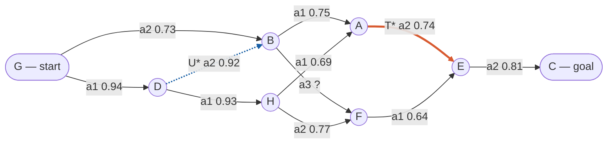

# Figure 1 — Seed 1 routing graph

Source for Figure 1 in the methodology document. GitHub renders the block below
directly, so this page is both the editable source and the preview.

Graph built by the frozen generator, schema 2.1, commit `5318c3e`.
Start `G`, goal `C`. `T*` is the on-route target the interventions edit;
`U*` is the off-route control.

## Notes for editors

- `linkStyle` is index-based and counts edges in declaration order starting at 0.
  `linkStyle 2` is `A --> E` (orange, `T*`) and `linkStyle 7` is `D --> B`
  (blue dashed, `U*`). Adding or reordering edges shifts these — recount after
  any structural change.
- Keep every edge label in quotes. Unquoted labels break the parse as soon as
  they contain `(`, `)`, `,`, `:` or `#`, and the resulting error names the whole
  diagram rather than the offending line.
- When pasting into mermaid.live, start at `flowchart` and omit the surrounding
  Markdown fences — the editor reads them as diagram text and reports
  `UnknownDiagramError`.
- Action labels are per-node. Actions are relabelled randomly at every node, so
  `a1` at `A` and `a1` at `H` are unrelated. Two edges sharing a label name is
  expected, not a duplicate.
- The earlier version of this figure was drawn without arrowheads. Each two-way
  pair (`G`/`D`, `D`/`H`, `A`/`H`) therefore rendered as two parallel lines and
  read as a doubled link with two probabilities. Arrowheads resolve it.

## Open items

Eleven of sixteen links are represented. Before this figure is treated as final,
verify against `seed1_sto.json`:

- probability on `G --> D` (0.94 or 0.77 in the original render)
- probability on `H --> A` (0.69 or 0.91 in the original render)
- probability on `B --> F`, currently unknown
- the five remaining links, not yet included
