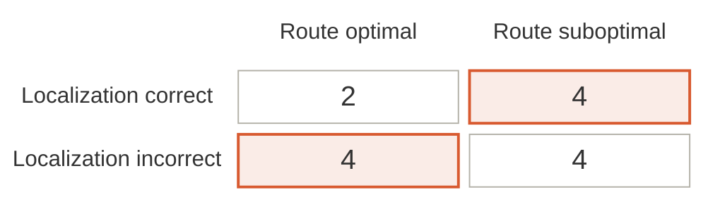

# Figure 2 — Localization crossed with route optimality

Source for Figure 2 in the methodology document. GitHub renders the block
below directly, so this page is both the editable source and the preview.

Stochastic mode, Gemma 4 E4B, K = 5, one instance per seed, silent break.
Counts are over n = 14 instances. The two shaded cells are the discordant
outcomes and hold 8 of 14.



Caption used in the document:

> Figure 2. Localization accuracy crossed with route optimality, stochastic
> mode (Gemma 4 E4B, n = 14). Shaded cells mark the discordant outcomes,
> 8 of 14.

## Deterministic variant

Same structure, counts 9 / 5 / 1 / 0 over n = 15. Replace the four cell
values and leave everything else untouched:

```
  rowCorrect["Localization correct"]     cellHitHit["9"]   cellHitMiss["5"]
  rowIncorrect["Localization incorrect"] cellMissHit["1"]  cellMissMiss["0"]
```

## Notes for editors

- Cell names encode the intersection: `cellHitMiss` is localization correct
  with a suboptimal route. Reading the code does not require counting
  across the grid.
- Styling lives in the `classDef` block, not on the cells. To change the
  highlight colour, edit one line.
- Class names describe meaning, not appearance — `discordant`, not
  `orange`. Switching the emphasis to a heavier border later leaves the
  names still accurate.
- The shading is the finding, not decoration. If good routing followed
  from understanding the change, the discordant cells would be empty.
- Keep row and column labels similar in length. `block-beta` sizes each
  column to its widest label, so a long row label squeezes the count cells.
- `block-beta` requires Mermaid 11 or newer. On older versions the block
  fails to render.
- When pasting into mermaid.live, start at `block-beta` and omit the
  surrounding Markdown fences — the editor reads them as diagram text and
  reports `UnknownDiagramError`.
- Export SVG rather than PNG for the document: it stays sharp in print and
  Word imports it natively. Google Docs cannot import SVG, so use PNG at 3x
  there.

## Consistency check

The four counts must reconcile with the probe totals reported in the
results section:

- localization correct = `cellHitHit` + `cellHitMiss`
- route optimal = `cellHitHit` + `cellMissHit`
- all four cells sum to the instance count for that mode

Stochastic: 2 + 4 = 6 localization correct, 2 + 4 = 6 optimal, total 14.
Deterministic: 9 + 5 = 14 localization correct, 9 + 1 = 10 optimal, total 15.
